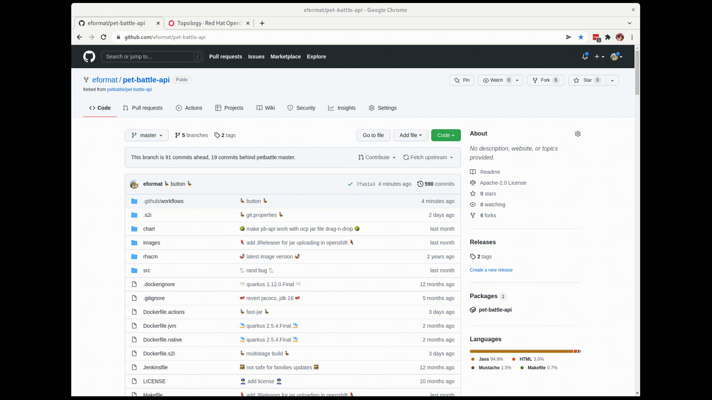

# bring-back-the-easy-button 🦩🦩🦩

Does anyone remember the heady days when there was an easy button to deploy from a GitHub code repo to OpenShift ?

[](https://github.com/eformat/pet-battle-api/actions/workflows/oc_deploy.yaml)

Don't get me wrong, i 💕 ArgoCD, GitOps and all things CICD .. but sometimes i want the easy button 🔘

Here in Queensland 🏖️ i have reinvented a modern take on the easy button using [GitHub Actions](https://github.com/eformat/pet-battle-api/blob/master/.github/workflows/oc_deploy.yaml). This incorporates some very handy [redhat-actions](https://github.com/redhat-actions) and a bit of scripting. Checkout the [source code](https://github.com/eformat/pet-battle-api) if you want to learn more.



If you like to automate the api call, you can checkout the [workflow dispatch documentation](https://docs.github.com/rest/reference/actions#create-a-workflow-dispatch-event).

e.g.
```bash
GITHUB_TOKEN=<your github token>
OCP_API=<oc whoami --show-server>
OCP_TOKEN=<oc whoami --show-token>
S2I_BUILDER=<the name of an s2i builder image e.g. java:openjdk-17>
REPONAME=<github repo name e.g. eformat/pet-battle-api>
ACTION=oc_deploy.yaml # name of the actions file
REF=master # branch, tag or git reference

curl -vv \
  -X POST \
  -H "Accept: application/vnd.github.v3+json" \
  -H "Authorization: token ${GITHUB_TOKEN}" \
  https://api.github.com/repos/${REPONAME}/actions/workflows/${ACTION}/dispatches \
  -d "{\"ref\":\"${REF}\", \"inputs\":{\"ocpAPI\": \"${OCP_API}\", \"ocpToken\": \"${OCP_TOKEN}\", \"s2iBuilder\": \"${S2I_BUILDER}\"}}"
```
